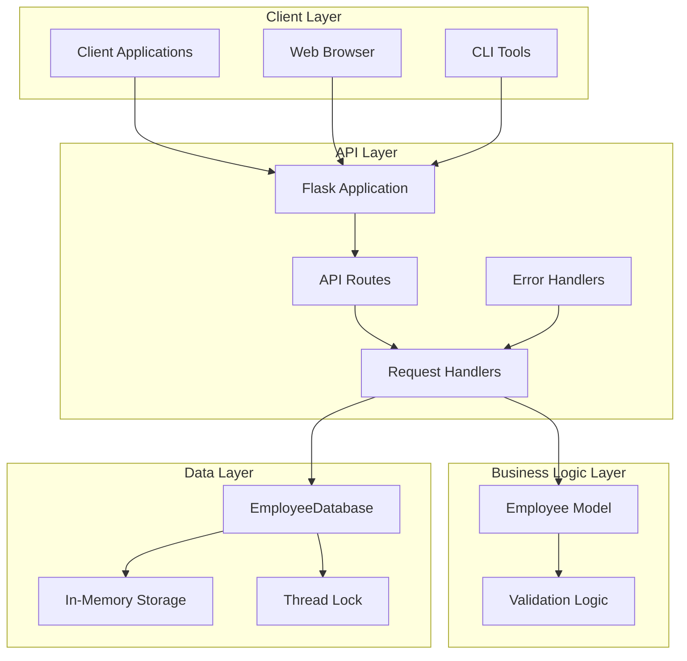
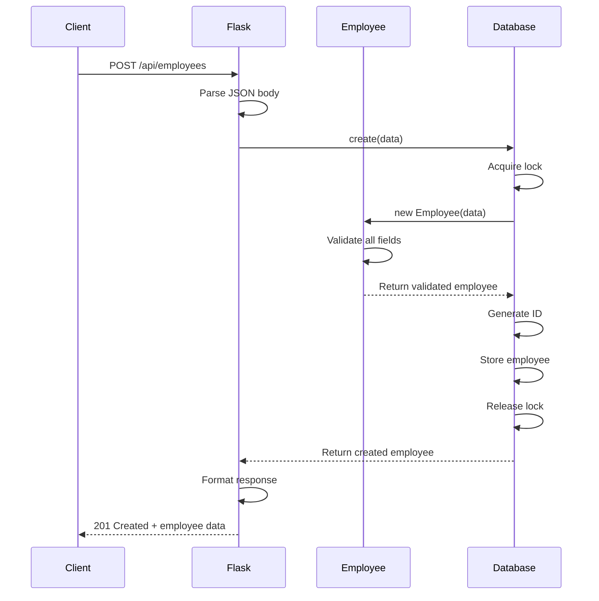
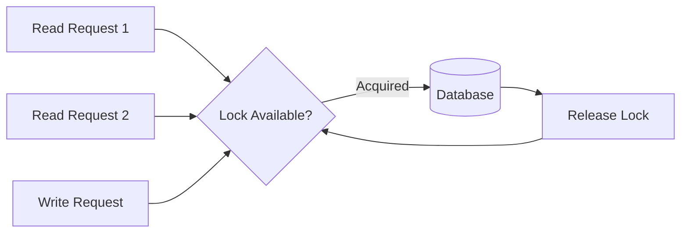
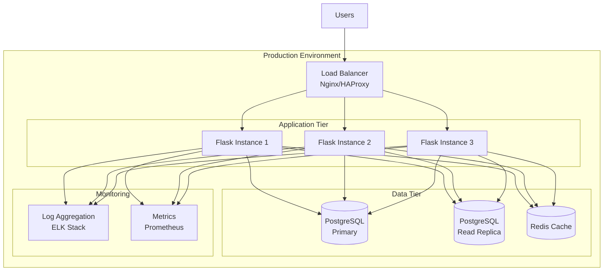

# Technical Design Document: Employee Management System

## Problem Statement

Organizations need a lightweight, reliable system to manage employee information efficiently. The current challenge involves:

- **Data Management**: Storing and retrieving employee records with CRUD operations
- **Data Integrity**: Ensuring data validation and consistency across concurrent operations
- **API Access**: Providing a RESTful API for integration with various client applications
- **Simplicity**: Minimizing deployment complexity while maintaining reliability
- **Scalability**: Handling concurrent requests safely without data corruption

**Key Requirements:**
- Create, Read, Update, Delete (CRUD) operations for employee records
- Search and filter capabilities by department
- Thread-safe data access for concurrent operations
- Comprehensive input validation
- RESTful API design with proper HTTP semantics
- Cross-origin resource sharing (CORS) support for frontend integration

## Proposed Solution

### System Architecture

The Employee Management System follows a three-tier architecture pattern with clear separation of concerns:



### Component Breakdown and Responsibilities

#### 1. **API Layer (app.py)**

**Responsibilities:**
- HTTP request handling and routing
- Request/response serialization (JSON)
- Error handling and HTTP status code management
- CORS configuration
- Health check endpoint

**Key Components:**
- `Flask Application`: Web framework for handling HTTP requests
- `Route Handlers`: Functions mapped to specific endpoints
- `Response Formatters`: Standardized success/error response structure
- `Error Handlers`: Global error handling for 404, 405, and 500 errors

**API Endpoints:**
| Method | Endpoint | Purpose | Status Codes |
|--------|----------|---------|--------------|
| GET | `/api/health` | Health check | 200 |
| POST | `/api/employees` | Create employee | 201, 400, 500 |
| GET | `/api/employees` | List all employees | 200, 500 |
| GET | `/api/employees/{id}` | Get single employee | 200, 404, 500 |
| PUT | `/api/employees/{id}` | Update employee | 200, 400, 404, 500 |
| DELETE | `/api/employees/{id}` | Delete employee | 200, 404, 500 |
| GET | `/api/employees/search` | Search by department | 200, 400, 500 |

#### 2. **Business Logic Layer (employee.py)**

**Responsibilities:**
- Employee data model definition
- Input validation and sanitization
- Business rule enforcement
- Data type conversions

**Validation Rules:**
- **Name**: 2-100 characters, required, trimmed whitespace
- **Email**: Valid email format (RFC 5322), unique, required
- **Department**: 2-50 characters, required
- **Role**: 2-50 characters, required
- **Hire Date**: YYYY-MM-DD format, not in future, after 1900-01-01

**Key Methods:**
- `__init__()`: Constructor with validation
- `to_dict()`: Serialize to dictionary
- `_validate_*()`: Individual field validators

#### 3. **Data Layer (database.py)**

**Responsibilities:**
- Data persistence (in-memory)
- CRUD operations implementation
- Thread-safe concurrent access
- ID generation and management
- Search and filter operations

**Key Features:**
- Thread-safe operations using `threading.Lock`
- Auto-incrementing ID generation
- Email uniqueness enforcement
- Department-based search with case-insensitive matching

**Key Methods:**
- `create(data)`: Create new employee record
- `get_all()`: Retrieve all employees
- `get_by_id(id)`: Retrieve single employee
- `update(id, data)`: Update existing employee
- `delete(id)`: Remove employee
- `search_by_department(dept)`: Filter by department

### Data Flow Diagram



### API Design and Data Models

#### Employee Data Model

```json
{
  "id": "integer (auto-generated, immutable)",
  "name": "string (2-100 chars, required)",
  "email": "string (valid email, unique, required)",
  "department": "string (2-50 chars, required)",
  "role": "string (2-50 chars, required)",
  "hire_date": "string (YYYY-MM-DD, required)"
}
```

#### Response Format

**Success Response:**
```json
{
  "success": true,
  "data": {
    /* Response payload */
  }
}
```

**Error Response:**
```json
{
  "success": false,
  "error": "Error message describing the issue"
}
```

### Security Considerations

#### Current Security Measures

1. **Input Validation**: All inputs validated at model level
   - Prevents injection attacks through strict validation
   - Type checking ensures data integrity
   - Length limits prevent buffer overflow-style attacks

2. **Email Validation**: RFC 5322 compliant email validation
   - Prevents malformed email addresses
   - Regex-based validation with proper escaping

3. **Debug Mode Control**: Production-safe by default
   - Debug mode disabled unless explicitly enabled via `FLASK_DEBUG` environment variable
   - Prevents information disclosure in production

4. **CORS Configuration**: Allows cross-origin requests
   - Currently allows all origins (suitable for development)
   - Should be restricted in production environments

5. **Error Handling**: Sanitized error messages
   - No stack traces or sensitive information in error responses
   - Consistent error format

#### Security Recommendations for Production

1. **Authentication & Authorization**
   - Implement JWT or OAuth2 for API authentication
   - Add role-based access control (RBAC)
   - Consider API key authentication for service-to-service

2. **HTTPS/TLS**
   - Enforce HTTPS in production
   - Use proper TLS certificates
   - Implement HSTS headers

3. **Rate Limiting**
   - Add rate limiting to prevent abuse
   - Implement per-IP and per-user limits
   - Consider using Flask-Limiter

4. **CORS Hardening**
   - Restrict allowed origins to known domains
   - Specify allowed methods and headers
   - Set appropriate credentials policy

5. **Audit Logging**
   - Log all data modifications
   - Include user identity and timestamp
   - Store logs securely

6. **Data Encryption**
   - Encrypt sensitive data at rest
   - Use proper key management
   - Consider encrypting PII fields

7. **SQL Injection Prevention**
   - Current in-memory storage immune to SQL injection
   - When migrating to SQL database, use parameterized queries
   - Consider ORM like SQLAlchemy

### Performance Requirements

#### Response Time Targets

| Operation | Target | Acceptable | Notes |
|-----------|--------|------------|-------|
| GET /health | < 50ms | < 100ms | Health check must be fast |
| POST /employees | < 50ms | < 200ms | Includes validation |
| GET /employees | < 100ms | < 500ms | Depends on dataset size |
| GET /employees/{id} | < 20ms | < 100ms | Direct lookup |
| PUT /employees/{id} | < 50ms | < 200ms | Includes validation |
| DELETE /employees/{id} | < 20ms | < 100ms | Direct deletion |
| GET /search | < 100ms | < 500ms | Linear search, O(n) |

#### Scalability Considerations

**Current Limitations:**
- **In-Memory Storage**: Limited by available RAM
- **Single Process**: No horizontal scaling
- **Linear Search**: O(n) complexity for department search
- **Thread Locking**: Serialized write operations

**Scaling Strategy:**

1. **Vertical Scaling (Short-term)**
   - Increase server RAM for larger datasets
   - Optimize Python interpreter (PyPy)
   - Add caching layer (Redis)

2. **Horizontal Scaling (Medium-term)**
   - Migrate to persistent database (PostgreSQL)
   - Implement database connection pooling
   - Add load balancer (Nginx/HAProxy)
   - Deploy multiple Flask instances

3. **Performance Optimization (Long-term)**
   - Add database indexing (email, department)
   - Implement pagination for list endpoints
   - Add caching layer for frequently accessed data
   - Consider read replicas for read-heavy workloads

**Throughput Targets:**
- **Current**: ~1000 requests/second (single instance)
- **Target**: 10,000 requests/second (with scaling)
- **Maximum**: 100,000 requests/second (with full optimization)

#### Concurrency

**Current Approach:**
- Thread-safe operations via `threading.Lock`
- Supports multiple concurrent requests
- Write operations serialized
- Read operations blocked during writes

**Concurrency Model:**


### Deployment Strategy

#### Development Deployment

```bash
# Install dependencies
pip install -r requirements.txt

# Run in development mode
FLASK_DEBUG=true python app.py
```

**Development Configuration:**
- Debug mode enabled
- Runs on localhost:5000
- Auto-reload on code changes
- Detailed error messages

#### Production Deployment

**Option 1: Standalone Production Server**
```bash
# Install dependencies
pip install -r requirements.txt gunicorn

# Run with Gunicorn (production WSGI server)
gunicorn -w 4 -b 0.0.0.0:5000 app:app
```

**Option 2: Docker Deployment**
```dockerfile
FROM python:3.11-slim

WORKDIR /app
COPY requirements.txt .
RUN pip install --no-cache-dir -r requirements.txt

COPY . .

EXPOSE 5000
CMD ["gunicorn", "-w", "4", "-b", "0.0.0.0:5000", "app:app"]
```

**Option 3: Kubernetes Deployment**
```yaml
apiVersion: apps/v1
kind: Deployment
metadata:
  name: employee-api
spec:
  replicas: 3
  selector:
    matchLabels:
      app: employee-api
  template:
    metadata:
      labels:
        app: employee-api
    spec:
      containers:
      - name: api
        image: employee-api:latest
        ports:
        - containerPort: 5000
        env:
        - name: FLASK_DEBUG
          value: "false"
        resources:
          requests:
            memory: "256Mi"
            cpu: "250m"
          limits:
            memory: "512Mi"
            cpu: "500m"
```

#### Deployment Checklist

- [ ] Set `FLASK_DEBUG=false` in production
- [ ] Configure CORS to restrict allowed origins
- [ ] Set up HTTPS/TLS certificates
- [ ] Configure reverse proxy (Nginx)
- [ ] Set up monitoring and logging
- [ ] Configure health check endpoints
- [ ] Set up backup strategy (if using persistent storage)
- [ ] Configure rate limiting
- [ ] Set up CI/CD pipeline
- [ ] Configure environment-specific settings
- [ ] Set up secret management (API keys, credentials)
- [ ] Configure firewall rules
- [ ] Set up container orchestration (if using containers)
- [ ] Configure auto-scaling policies
- [ ] Set up disaster recovery plan

### Infrastructure Architecture



## Trade-offs and Alternatives Considered

### Architecture Decisions

#### 1. In-Memory Storage vs. Persistent Database

**Decision: In-Memory Storage (Current)**

**Pros:**
- Simplicity: No database setup required
- Performance: Extremely fast read/write operations
- Deployment: Easy to deploy and test
- Development: Quick iteration and testing

**Cons:**
- Data loss on restart
- Limited by available RAM
- No data persistence
- Single instance limitation

**Alternative: PostgreSQL/MySQL**

**Pros:**
- Data persistence
- ACID compliance
- Advanced querying capabilities
- Battle-tested reliability
- Better scalability

**Cons:**
- Additional infrastructure complexity
- Requires database administration
- Slower than in-memory storage
- Connection management overhead

**Recommendation:** Start with in-memory for MVP/development, migrate to PostgreSQL for production.

#### 2. Flask vs. FastAPI vs. Django

**Decision: Flask**

**Why Flask:**
- Lightweight and minimal
- Perfect for RESTful APIs
- Large ecosystem
- Easy to learn and use
- Flexible architecture

**FastAPI Alternative:**
- Better performance (async)
- Built-in API documentation (OpenAPI)
- Type hints and validation (Pydantic)
- Modern Python features
- Trade-off: Newer, smaller ecosystem

**Django Alternative:**
- Full-featured framework
- Built-in ORM and admin panel
- More opinionated architecture
- Trade-off: Heavier, more complex for simple APIs

#### 3. Thread Locking vs. Async/Await

**Decision: Thread Locking**

**Pros:**
- Simple to implement and understand
- Works with synchronous code
- Reliable for CRUD operations
- Compatible with Flask

**Cons:**
- Blocks on I/O operations
- Limited concurrency for writes
- Not optimal for high concurrency

**Alternative: Async/Await with asyncio**

**Pros:**
- Better concurrency
- Non-blocking I/O
- More efficient resource usage

**Cons:**
- More complex code
- Requires async-compatible libraries
- Harder to debug
- Would require FastAPI instead of Flask

#### 4. Validation Approach

**Decision: Model-level validation**

**Pros:**
- Centralized validation logic
- Reusable across endpoints
- Easier to test
- Clear error messages

**Cons:**
- Validation happens after parsing
- No automatic API documentation

**Alternative: Schema validation (Marshmallow/Pydantic)**

**Pros:**
- Automatic serialization/deserialization
- Better API documentation
- Type safety

**Cons:**
- Additional dependency
- Learning curve
- More boilerplate code

### Design Patterns

The system implements several design patterns:

1. **Repository Pattern**: Database abstraction layer
2. **Factory Pattern**: Employee object creation
3. **Singleton Pattern**: Database instance
4. **Strategy Pattern**: Validation strategies
5. **Decorator Pattern**: Flask route decorators

## Success Metrics

### Functional Metrics

| Metric | Target | Measurement Method |
|--------|--------|-------------------|
| API Uptime | 99.9% | Health check monitoring |
| Request Success Rate | > 99% | HTTP 2xx response ratio |
| Data Validation Accuracy | 100% | Invalid data rejection rate |
| API Response Correctness | 100% | Integration test pass rate |

### Performance Metrics

| Metric | Target | Measurement Method |
|--------|--------|-------------------|
| Average Response Time | < 100ms | APM tools (New Relic, DataDog) |
| 95th Percentile Response Time | < 250ms | Response time distribution |
| 99th Percentile Response Time | < 500ms | Response time distribution |
| Throughput | 1000 req/sec | Load testing (Locust, JMeter) |
| Concurrent Users | 100+ | Load testing |

### Quality Metrics

| Metric | Target | Measurement Method |
|--------|--------|-------------------|
| Code Coverage | > 80% | pytest-cov |
| Linting Score | 100% | pylint, flake8 |
| Type Coverage | > 90% | mypy |
| Documentation Coverage | 100% | Docstring analysis |
| Security Vulnerabilities | 0 critical | Bandit, Safety |

### Operational Metrics

| Metric | Target | Measurement Method |
|--------|--------|-------------------|
| Deployment Frequency | Daily | CI/CD pipeline |
| Mean Time to Recovery | < 1 hour | Incident tracking |
| Change Failure Rate | < 5% | Post-deployment monitoring |
| Lead Time for Changes | < 1 day | Git metrics |

### Business Metrics

| Metric | Target | Measurement Method |
|--------|--------|-------------------|
| API Adoption Rate | Track growth | Usage analytics |
| User Satisfaction | > 4.5/5 | User surveys |
| Feature Request Rate | Track trends | Issue tracker |
| Support Ticket Volume | Decreasing trend | Support system |

### Monitoring and Alerting

**Key Alerts:**
- Response time > 1 second (Warning)
- Error rate > 1% (Critical)
- Service downtime (Critical)
- Memory usage > 80% (Warning)
- CPU usage > 90% (Warning)

**Monitoring Tools:**
- Application Performance Monitoring (APM)
- Log aggregation and analysis
- Real-time metrics dashboard
- Health check endpoints
- Synthetic monitoring

## Future Enhancements

### Phase 1: Foundation (Months 1-3)
- [ ] Migrate to PostgreSQL database
- [ ] Add comprehensive unit tests (80%+ coverage)
- [ ] Implement authentication (JWT)
- [ ] Add API documentation (Swagger/OpenAPI)
- [ ] Set up CI/CD pipeline

### Phase 2: Scale (Months 4-6)
- [ ] Add pagination for list endpoints
- [ ] Implement caching layer (Redis)
- [ ] Add rate limiting
- [ ] Implement role-based access control (RBAC)
- [ ] Add audit logging

### Phase 3: Enhance (Months 7-9)
- [ ] Add advanced search (by name, email, role)
- [ ] Implement sorting capabilities
- [ ] Add bulk operations support
- [ ] Add export functionality (CSV, Excel)
- [ ] Implement webhooks for events

### Phase 4: Optimize (Months 10-12)
- [ ] Performance optimization
- [ ] Add database indexing
- [ ] Implement read replicas
- [ ] Add comprehensive monitoring
- [ ] Implement automated backups

## Conclusion

This design document provides a comprehensive blueprint for the Employee Management System. The solution balances simplicity with functionality, making it easy to deploy while maintaining the flexibility to scale. The modular architecture allows for incremental improvements and migration to more robust infrastructure as needs grow.

The system successfully addresses the core requirements of employee data management while maintaining code quality, security, and performance standards. The clear separation of concerns and well-defined interfaces make the system maintainable and extensible for future enhancements.
